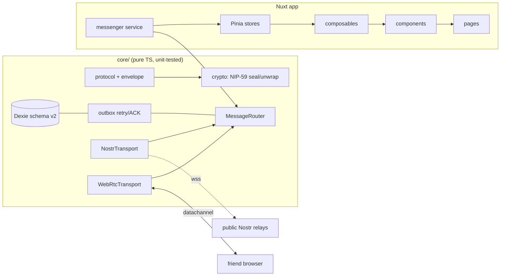

# Telepatty

**Telepatty** is a serverless, end-to-end encrypted, installable PWA messenger built with Nuxt 4, Nuxt UI, Nostr (NIP-59 gift-wrapped private DMs) and WebRTC. There is no backend: your identity is a keypair generated in your browser; messages go peer-to-peer over WebRTC when possible and through public Nostr relays as an encrypted mailbox otherwise.

## Features

- 🔑 Browser-generated keypair identity (npub/nsec, recovery-key backup, optional app lock with AES-GCM + PBKDF2, 60-day session)
- 🤝 Add friends via invite link (data in the `#fragment`, never sent to the server), QR code, or short friend code — no user directory
- 💬 1-to-1 chats over a `Transport` abstraction: **Nostr first** (NIP-59 gift wrap, NIP-40 expiration), WebRTC DataChannel as the live/fast path
- 📮 Durable outbox with retry/backoff, delivery & read receipts, per-conversation Lamport ordering, disappearing messages (locally enforced + relay expiration tags)
- 🌓 Dark hacker theme with live customization (presets, colors, radius, density, texture), RTL Persian + English (fa/en), Jalali dates
- 📲 Installable PWA: mobile install banner (Android prompt + iOS instructions), Settings install entry, prompt-based SW updates, offline shell
- 🔐 Permissions Center (notifications, camera, persistent storage, clipboard) — never requested without a gesture, denied-state guidance
- 💾 Encrypted backups (passphrase, PBKDF2/AES-GCM, schema-versioned), chat export (text/JSON)

## Honest limitations

- **No push notifications / background sync.** Messages arrive when the app is open. Local notifications only work in-app.
- **Relay retention is not guaranteed** — offline messages may expire after days depending on the relay.
- **Metadata is visible** to relays and network observers (IP, timing, who talks to which relay).
- **No forward secrecy** in v1; a modified client can ignore disappearing-message timers.

## Architecture



Layers: `core/` (no Vue imports) → `app/stores` (Pinia) → `app/composables` → `app/components` → `app/pages`. The `MessageRouter` picks a transport per envelope (WebRTC when the peer channel is open, otherwise Nostr); transports can be replaced without touching UI code.

## Setup

```bash
pnpm install
pnpm dev        # http://localhost:3000
pnpm test       # vitest (protocol, crypto, outbox, router, receive, invites, db/migration, purge, backup, lock, permissions, avatar)
pnpm generate   # static build into .output/public (includes PWA sw.js + manifest)
pnpm preview    # serve the static build
```

## Deploying to GitHub Pages

Set the base URL env var to your repo path before generating:

```bash
TELEPATTY_BASE_URL=/telepatty/ pnpm generate
```

Or push to `main` — the included GitHub Actions workflow (`.github/workflows/deploy.yml`) builds and deploys automatically, including the SPA fallback (`404.html`).

> Invite links carry data only in the URL fragment (`#/add?...`), so nothing ever reaches GitHub's servers.

## Threat model (summary)

- Message content: E2E encrypted (NIP-44 inside NIP-59 gift wrap), sender authenticated via seal signature.
- Identity: keypair on device; losing the nsec key loses the account. Optional passphrase lock encrypts the key at rest (unlock required on each launch while the lock is enabled; the 60-day session governs silent re-lock prompts).
- Metadata: exposed to relays/network (see limitations above).
- Transport: WebSocket to relays (never SW-cached), WebRTC DataChannel (STUN by default; configurable ICE).

## License

MIT
